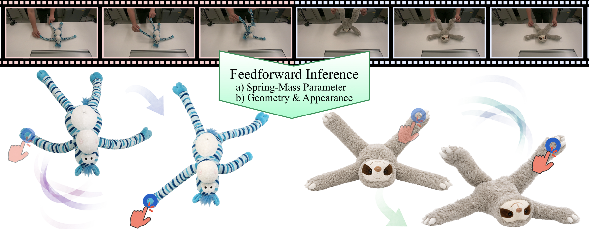

# MatPhys: Learning material-aware physics parameters for deformable object simulation from videos

<span class="author-block">
<a target="_blank" href="https://yrainy0615.github.io/">Yang Yang</a><sup>1,3</sup>,
</span>
<span class="author-block">
<a target="_blank">Yiyan Wang</a><sup>2,3</sup>,
</span>
<span class="author-block">
<a target="_blank">Zheming Liu</a><sup>3</sup>,
</span>
<span class="author-block">
<a target="_blank" href="https://iwanao731.github.io/">Naoya Iwamoto</a><sup>3</sup>,
</span>

<span class="author-block"><sup>1</sup>The University of Osaka</span>
<span class="author-block"><sup>2</sup>The Univerisity of Tokyo</span>
<span class="author-block"><sup>3</sup>Huawei Technologies Japan K.K.</span>


### [Website]() | [Paper]() | [Arxiv](https://arxiv.org/abs/2605.19386)

### Overview
This repository contains the official implementation of the **MatPhys** framework.



### Setup

Follow the environment setup in the [PhysTwin](https://github.com/Jianghanxiao/PhysTwin/) repository (Linux / Windows / Docker, `env_install`, pretrained model download, and optional data download). MatPhys builds on the same stack and expects a working `phystwin` conda environment unless noted otherwise in a script.

For the original 22-case multi-view dataset (`data/different_types`), data processing follows PhysTwin's instructions. Once the cases are in place you can re-run preprocessing with `bash scripts/preprocess/multi_view_all.sh` and the PhysTwin per-edge baseline with the scripts under `scripts/baseline/` (see "Baseline" below).

### Pretrained model

Download the MatPhys pretrained weights ([`checkpoint_all_latest.pth` on Google Drive](https://drive.google.com/file/d/1UiZuOVdcGwAkuAeJlrSi24RxCEsZvzz1/view?usp=sharing)) and place them at:

```text
checkpoints/checkpoint_all_latest.pth
```

Use this checkpoint for inference or to export per-case physics parameters without retraining:

```bash
# Roll out on the test split (metrics written next to the ckpt)
bash scripts/ours/inference.sh checkpoints/checkpoint_all_latest.pth cuda:0 test

# Dump spring/collision params for interactive_playground.py
python semantic/dump_physics_params.py \
    --ckpt checkpoints/checkpoint_all_latest.pth \
    --case_name <case> \
    --base_path data/different_types \
    --case_to_material semantic/case_to_material_different_types.json
```

## Data preparation

### Monocular video (MatPhys)

```bash
bash scripts/preprocess/single_video.sh <video> <case_name> <category> <device_id> \
    [base_path] [results_dir] [phystwin_env] [cupid_env]
```

Example:

```bash
bash scripts/preprocess/single_video.sh /data/clip.mp4 my_sloth sloth 0
```

`<category>` is the GroundedSAM2 noun (`sloth`, `zebra`, …). Optional
env vars: `MAX_FRAMES`, `FPS`, `START_SEC` (input truncation),
`PROMPT_OVERRIDE` (override segmentation prompt),
`TRAIN_FRAMES` (split point passed to `prepare_final_data_case.py`).
Defaults: `base_path=data/single_view`, `results_dir=results`.

### 3DGS scaffold

After preprocessing, train per-case 3D Gaussians (one-off):

```bash
bash scripts/preprocess/gs_train.sh         # train GS for all cases
bash scripts/preprocess/gs_simulate.sh # simulation-ready GS
```

### Semantic / material chain

These produce the inputs consumed by the predictor (DINO features,
part segmentation, material distribution, GPT physics priors). Each
script accepts either an all-cases sweep or a single `<case_name>`.

```bash
bash scripts/preprocess/semantic/lift_dino.sh   <device_id>            # lift DINOv2 to GS
bash scripts/preprocess/semantic/sym.sh         <device_id>            # propagate by symmetry
bash scripts/preprocess/semantic/material.sh    <device_id>            # part segmentation + material
bash scripts/preprocess/semantic/extract_features.sh <base_path> <device_id>  # DINO features cache
bash scripts/preprocess/semantic/extract_gpt_prior.sh   <OPENAI_API_KEY>          # GPT-4o priors
```

For Cupid reconstruction outside of `run_single_video.sh`:

```bash
bash scripts/preprocess/semantic/cupid.sh <case_name> <device_id>
```

## Baseline (PhysTwin per-edge optimization)

The PhysTwin baseline runs in three stages over the multi-view dataset.

```bash
# stage 1: CMA-ES global optimization
bash scripts/baseline/optimize_cma.sh <case_name>          # one case
bash scripts/baseline/optimize_cma_all.sh                  # all cases

# stage 2: per-edge first-order optimization
bash scripts/baseline/train_warp.sh <case_name>
bash scripts/baseline/train_warp_all.sh

# inference: roll out optimized params
bash scripts/baseline/inference_warp.sh <case_name>
bash scripts/baseline/inference_warp_all.sh
```

Each `*_all.sh` enumerates cases via `<base_path>/*` (default
`data/different_types`). Outputs land under `experiments/<case>/`
(predictions) and `experiments_optimization/<case>/` (optimization
intermediates).

## Training (Ours)

The final recipe is **per-case fitting with smooth/damp regularizer**.

### Single case

```bash
bash scripts/ours/train_single.sh <case_name> <device_id> \
    [base_path] [case_to_material] [save_root] [epochs]
```

Example for a single-video case:

```bash
bash scripts/ours/train_single.sh monkey 0 \
    data/single_view semantic/case_to_material_monkey_only.json \
    checkpoints/monkey_ours 200
```

Useful env-var overrides: `OBJECT_RADIUS` (default `0.02`),
`CONTROLLER_RADIUS` (default `0.04`).

### All  cases

```bash
bash scripts/ours/train_all.sh
```

Shards cases across GPUs `1,4,5,6,7` (LPT-balanced by frame count).
Saves to `checkpoints/per_case_smooth_fitall_<DATE_TAG>/<case>/`.
Override with `DATE_TAG=...` and edit the `GPUx_CASES` arrays.

Each run uses
`semantic/train_model_video_material_simple.py` with:

| flag | value | role |
|---|---|---|
| `--lambda_track` / `--lambda_geo` | `1.0` | warp rollout supervision |
| `--lambda_render` | `0` | masked GS render L1 (off) |
| `--lambda_phys_prior` | `1e-3` | GPT μ/σ/conf prior |
| `--lambda_acc_smooth` | `1e-2` | anti-vibration regularizer |
| `--logk_soft_clamp` | `0.25` | clamp on residual around prior |
| `--fit_all_frames` | — | fit train + test frames (per-case fit) |


### Inference

Roll out a trained checkpoint on the chosen split and dump metrics
next to the ckpt:

```bash
bash scripts/ours/inference.sh <ckpt> [device] [split] [cases]
# VIS=1 bash scripts/ours/inference.sh <ckpt>   # also dumps per-case .mp4 alongside the metrics
```

## Evaluation

```bash
bash scripts/eval/evaluate.sh                        # all cases
bash scripts/eval/evaluate.sh --case_name <case>     # single case
```

Runs three metrics:

- `evaluate_chamfer.py` → `results/final_results.csv`
- `evaluate_track.py`   → `results/final_track.csv`
- `gaussian_splatting/evaluate_render.py` → render PSNR/SSIM/LPIPS

For comparisons against the first-order per-edge optimization baseline
(stored in `experiments_optimization/`), roll out predictions with
`inference_warp.py` or `semantic/eval_simple_video.py` and feed them
through the same evaluator. 

## Visualization

```bash
python scripts/viz/tracking_overlay.py     # overlay tracking on video
python scripts/viz/sidebyside.py                    # side-by-side comparison video
python scripts/viz/keyframe_blends.py  # keyframe blends for figures
```

For interactive inspection: `interactive_playground.py`,
`scripts/viz/material.py`, `scripts/viz/render_results.py`,
`semantic/visualize_inference.py`.


